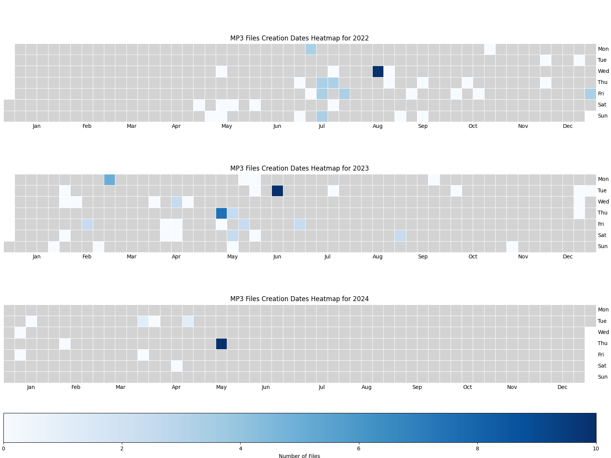

🎉 **Welcome to the Amazing File Creation Date Heatmap Generator!** 🎉

Do you want to visualize the creation dates of your files in a fun and colorful way? Look no further! 📅🌈

With our File Creation Date Heatmap Generator, you can turn boring file creation dates into beautiful, mesmerizing heatmaps! 🔥💻

<div style="text-align:center">

</div>

### How to Use:
1. **Clone the Repository**:
   - Clone this repository to your local machine:
     ```
     git clone https://github.com/your-username/your-repository.git
     ```

2. **Install Dependencies**:
   - Navigate to the cloned directory and run the following command to install the required dependencies:
     ```
     pip install -r requirements.txt
     ```

3. **Start the Application**:
   - After installing the dependencies, you'll find a `main.py` file in the directory.
   - Simply run the `main.py` file to start the application:
     ```
     python main.py
     ```

That's it! 🚀 Now sit back, relax, and enjoy exploring your file creation dates with our delightful heatmap generator! If you have any questions or suggestions, feel free to reach out. Happy heatmap-ing! 😄🎨